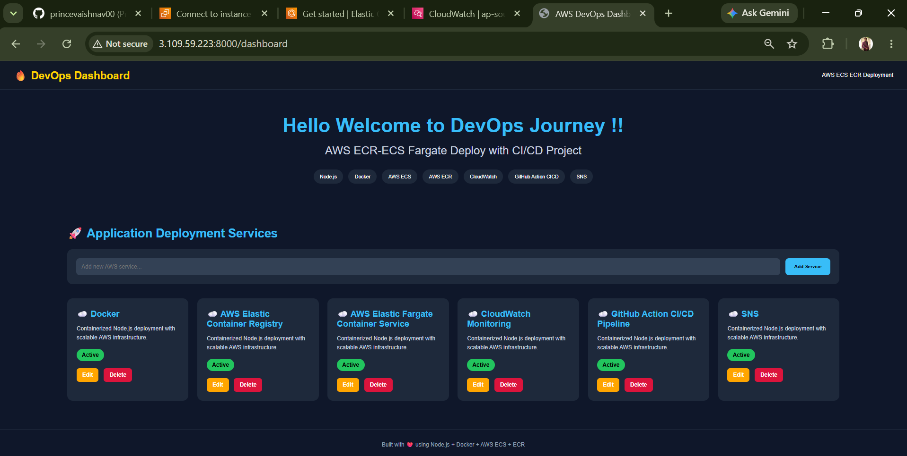

# 🚀 AWS ECR-ECS Fargate Deployment with CI/CD

This project demonstrates how a containerized application can be automatically built, stored, deployed and monitored on AWS using modern DevOps practices. The entire deployment process is triggered by a GitHub push and managed through a CI/CD pipeline powered by GitHub Actions.

---

## 🛠️ Tech Stack & Tools :

- GitHub
- GitHub Actions
- Docker
- Amazon ECR
- Amazon ECS Fargate
- Amazon CloudWatch
- Amazon SNS
- IAM

---

## 🏗️ Application Architecture :

  

---

## ✅️ Deployment Successful :

  

## ⚙️ CI/CD Workflow :

1. Developer pushes code to GitHub
2. GitHub Actions workflow is triggered
3. Docker image is built
4. Image is pushed to Amazon ECR
5. ECS Task Definition is updated
6. Amazon ECS Fargate deploys the latest container
7. CloudWatch collects application logs
8. Amazon SNS sends deployment notification via Email

---

## 🤔 Why Amazon ECR?

- Secure private Docker registry
- Native integration with Amazon ECS
- Easy image versioning
- No need to manage a separate registry

---

## 🤔 Why Amazon ECS Fargate?

- No server management
- No OS patching
- No infrastructure maintenance
- Focus on application deployment

---

## 🤔 Why ECS Instead of Kubernetes?

For a single application deployment, ECS is simpler and faster to manage.

- Less operational overhead
- Easy AWS integration
- Faster deployment setup
- Ideal for small and medium workloads

---

## 🐛 Challenges & Troubleshooting :

- ECR Repository Name Mismatch
- ECS Task Definition File Missing
- Container Name Mismatch
- ECS Service Not Found
- SNS Notification Configuration

---

## ✨ Key Features

- Automated CI/CD using GitHub Actions
- Dockerized application deployment
- Amazon ECR image management
- Amazon ECS Fargate deployment
- CloudWatch log monitoring
- SNS email notifications

---

## ⭐ Conclusion :

This project demonstrates real-world DevOps practices including :

- CI/CD Automation
- Containerization with Docker
- AWS Container Services
- Infrastructure Monitoring
- Deployment Notifications
- Troubleshooting & Debugging
